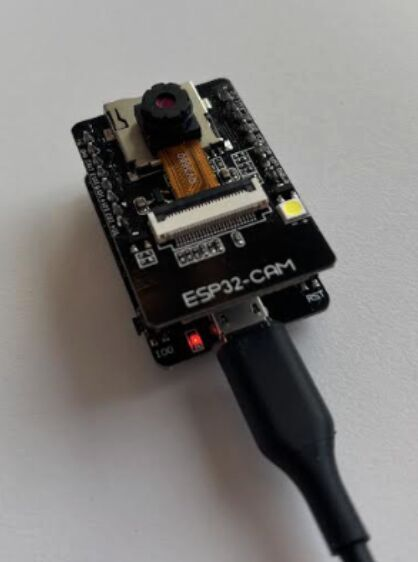
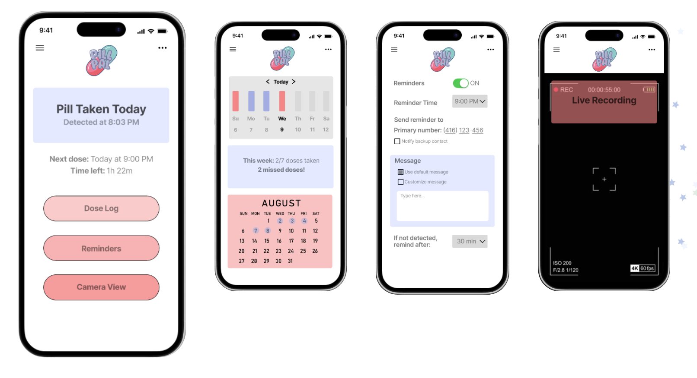
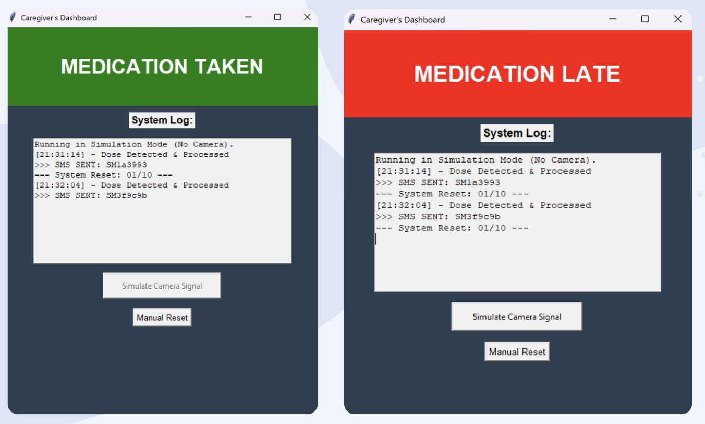
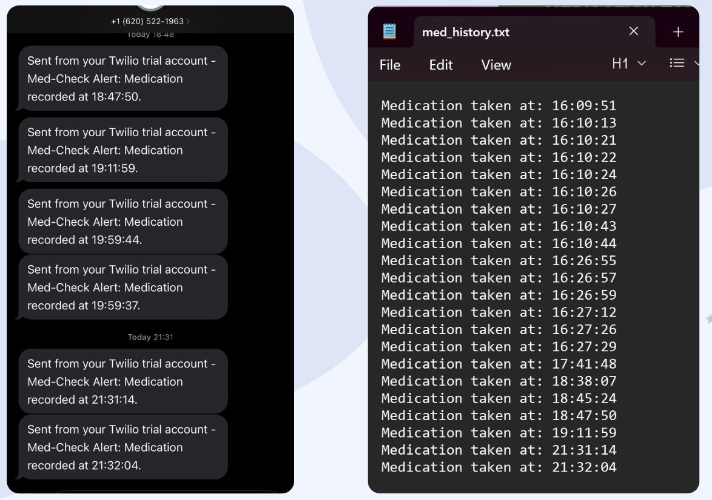

# PillPal | DeltaHacks 12 Hackathon Project 

## What is PillPal?
PillPal is a tool that monitors medication consistency through the use of an ESP32-CAM detection system and a Python caregiver dashboard. The tool detects the movement of a pill being taken, updates a real-time dashboard, logs medication acitvity, and then sends SMS alerts using Twilio. 

## Features
• Python caregiver dashboard built with Tkinter
• Pill movement detection through image comparison logic
• Real-time medication status updates
• Daily reset functionality
• Medication history logging
• SMS alert integration using Twilio

## How It Works
1. User receives a medication reminder.
2. Camera captures an image of the medication tray.
3. Pill detection algorithm verifies whether medication was taken.
4. Dashboard updates automatically.
5. If a dose is missed, the caregiver receives an SMS alert.

## Demo
### Hardware Setup

The ESP32-CAM monitors the medication tray and captures images for pill detection.

### User Interface

The mobile interface allows users to view schedules, receive reminders, and track medication status.

### Caregiver Dashboard

Caregivers can remotely monitor adherence and view the current medication status in real time.

### SMS Notifications

If a scheduled dose is missed, the system automatically sends a notification through Twilio to the designated caregiver.

## Technologies Used
• Python
• Tkinter
• Twilio API
• ESP32-CAM concept
• Image comparison logic
• Multithreading

## Files
• `caregiver_dashboard.py` - main dashboard interface
• `pill_detect.py` - pill detection logic
• `med_history.txt` - generated medication log file

## Skills Demonstratedb
• Python GUI development
• Hardware/software integration
• Real-time monitoring
• API integration
• Team-based hackathon development
